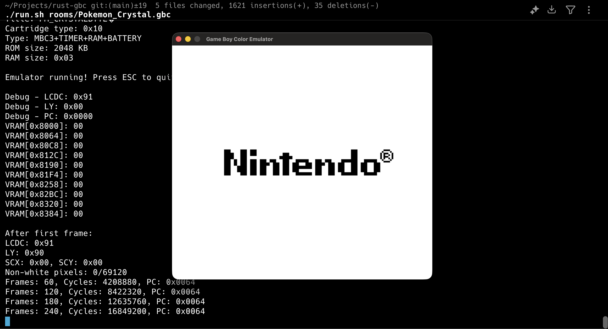

# rust-gbc

A Game Boy Color emulator written in Rust with SDL2 graphics rendering. This project implements the Sharp LR35902 CPU, PPU, memory management, and Boot ROM support to run authentic Game Boy games.



## Overview

rust-gbc is a functional Game Boy Color emulator that successfully executes the official Nintendo Boot ROM and renders the iconic Nintendo logo on screen. The emulator features a complete CPU instruction set, graphics rendering pipeline, memory bank controllers (MBC1/MBC3), and proper timing synchronization.

## Features

- **Complete CPU Implementation**: Sharp LR35902 8-bit processor with ~500 instructions
- **PPU (Picture Processing Unit)**: Background rendering at 160x144 resolution
- **Boot ROM Support**: Authentic Nintendo boot sequence with logo display
- **Memory Bank Controllers**: MBC1 and MBC3 support for larger ROMs
- **Graphics Display**: SDL2-based window rendering at 4x scale (640x576)
- **Real-time Emulation**: 60 FPS frame rate with proper cycle timing
- **Interrupt System**: VBlank, Timer, LCD, Serial, and Joypad interrupts
- **Timer System**: Accurate Game Boy timer implementation
- **Joypad Input**: Controller input handling (structure ready)

## Architecture

### Core Components

```
┌─────────────────────────────────────────┐
│           GameBoy Emulator              │
├─────────────────────────────────────────┤
│  CPU (Sharp LR35902)                    │
│  ├── Registers (AF, BC, DE, HL, SP, PC) │
│  ├── ALU & Control Logic                │
│  └── Instruction Decoder                │
├─────────────────────────────────────────┤
│  Bus                                     │
│  └── Memory-mapped I/O routing          │
├─────────────────────────────────────────┤
│  Memory                                  │
│  ├── 64KB Address Space                 │
│  ├── Boot ROM (256 bytes)               │
│  └── MBC (Memory Bank Controller)       │
├─────────────────────────────────────────┤
│  PPU (Picture Processing Unit)          │
│  ├── Background Rendering                │
│  ├── VRAM (8KB)                         │
│  └── Framebuffer (160x144)              │
├─────────────────────────────────────────┤
│  Peripherals                             │
│  ├── Timer                               │
│  ├── Interrupts                          │
│  └── Joypad                              │
├─────────────────────────────────────────┤
│  Display (SDL2)                          │
│  └── Window rendering & events          │
└─────────────────────────────────────────┘
```

### Memory Map

```
0000-00FF   Boot ROM (when enabled)
0000-3FFF   16KB ROM Bank 00 (cartridge)
4000-7FFF   16KB ROM Bank 01-NN (switchable)
8000-9FFF   8KB Video RAM (VRAM)
A000-BFFF   8KB External RAM (cartridge)
C000-CFFF   4KB Work RAM Bank 0
D000-DFFF   4KB Work RAM Bank 1
E000-FDFF   Echo RAM (mirror of C000-DDFF)
FE00-FE9F   Sprite Attribute Table (OAM)
FEA0-FEFF   Not Usable
FF00-FF7F   I/O Ports
FF80-FFFE   High RAM (HRAM)
FFFF        Interrupt Enable Register
```

## Tech Stack

- **Language**: Rust
- **Graphics**: SDL2 (0.37.0 with bundled feature)
- **Build System**: Cargo

## Quick Start

### Prerequisites

- Rust (latest stable version)
- Cargo
- SDL2 (bundled automatically via Cargo)

### Installation

1. Clone the repository:

```bash
git clone https://github.com/yourusername/rust-gbc.git
cd rust-gbc
```

2. Build the project:

```bash
cargo build --release
```

### Running the Emulator

#### Run Built-in Tests

Execute the internal CPU test suite:

```bash
cargo run --release
```

Expected output:

```
Running CPU tests...

Test 1: Basic Arithmetic
  [OK] Arithmetic operations work correctly

Test 2: 16-bit Operations
  [OK] 16-bit operations work correctly

Test 3: Stack Operations
  [OK] Stack operations work correctly

Test 4: Jump Operations
  [OK] Jump operations work correctly

Test 5: Bit Operations
  [OK] Bit operations work correctly

Test 6: Simple Program
  [OK] Simple program executed correctly

All tests passed!
```

#### Run with Game ROM

Run a Game Boy or Game Boy Color ROM:

```bash
./run.sh path/to/rom.gbc
```

Or using cargo directly:

```bash
cargo run --release path/to/rom.gb
```

Example:

```bash
./run.sh rooms/Tetris.gbc
```

### Controls

- **ESC**: Quit emulator
- **Arrow Keys**: D-Pad (structure ready, needs full implementation)
- **Z/X**: A/B buttons (structure ready, needs full implementation)

## Project Structure

```
rust-gbc/
├── src/
│   ├── main.rs           # Entry point, ROM loading, test suite
│   ├── cpu.rs            # Sharp LR35902 CPU implementation (1443 lines)
│   ├── memory.rs         # 64KB memory management
│   ├── bus.rs            # Memory-mapped I/O bus
│   ├── mbc.rs            # MBC1 and MBC3 controllers (254 lines)
│   ├── ppu.rs            # Picture Processing Unit
│   ├── display.rs        # SDL2 window and rendering
│   ├── bootrom.rs        # Nintendo Boot ROM data
│   ├── interrupts.rs     # Interrupt system
│   ├── timer.rs          # Game Boy timer
│   ├── joypad.rs         # Controller input
│   └── gameboy.rs        # Main emulator orchestration
├── Cargo.toml            # Dependencies and project metadata
├── .cargo/
│   └── config.toml       # Cargo configuration
├── run.sh                # Helper script for running ROMs
├── rooms/                # ROM files directory (not included)
└── README.md
```

## Current Status

### What Works

- **Boot ROM Execution**: The emulator successfully runs the official Nintendo Boot ROM
- **Logo Display**: Nintendo logo is rendered correctly on screen
- **CPU**: All major instruction groups implemented and tested
- **PPU**: Background layer rendering functional
- **Memory**: Full 64KB address space with MBC support
- **Display**: SDL2 window opens and updates at 60 FPS
- **Timing**: Accurate cycle counting and frame synchronization

### Known Limitations

- **Complex ROMs**: Commercial games like Pokémon Crystal may get stuck after boot sequence
- **Missing Features**: 
  - Sprite rendering (OBJ layer)
  - Sound (APU not implemented)
  - Full joypad integration
  - Serial communication
  - RTC (Real Time Clock for MBC3)
  - Save states

### Test Results

The emulator successfully passes all internal tests:

- Arithmetic operations
- 16-bit operations
- Stack manipulation
- Jump and call instructions
- Bit operations
- Program flow control

## Development

### Building from Source

```bash
# Debug build
cargo build

# Release build (optimized)
cargo build --release

# Run tests
cargo test

# Check for errors without building
cargo check
```

## References

This project was built with knowledge from the following resources:

- [Gameboy: Everything under the hood](https://dev.to/abhinavmir/gameboy-everything-under-the-hood-1p0b) - Comprehensive overview of Game Boy architecture
- [Resurrecting the GameBoy with Kiro](https://dev.to/michiel_8fb6/resurrecting-the-gameboy-with-kiro-5417) - Practical emulation insights
- [Meet the Game Boy Instruction Set](https://dev.to/meganesulli/meet-the-game-boy-instruction-set-3848) - CPU instruction reference
- [Working GameBoy CSS Art](https://dev.to/mustapha/i-made-a-working-gameboy-css-art-try-it-out-4m1j) - Game Boy design inspiration
- [Pan Docs](https://gbdev.io/pandocs/) - The comprehensive Game Boy technical reference
- [Game Boy CPU Manual](http://marc.rawer.de/Gameboy/Docs/GBCPUman.pdf) - Official CPU documentation

## License

This project is for educational purposes. Game Boy and Game Boy Color are trademarks of Nintendo.

---

Built with dedication and effort by **Marcos Mendes**

